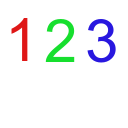

    

123os is a next-gen OS kernel designed as a hobby and fun project.

## Goals and requirements
* Code readability, e.g., understandable code
* Performance
* Compatability with most hardware

# Contributors
* [DanTheDev123](https://github.com/danthedev123)
* [GTH](https://github.com/gunnarhelgason)